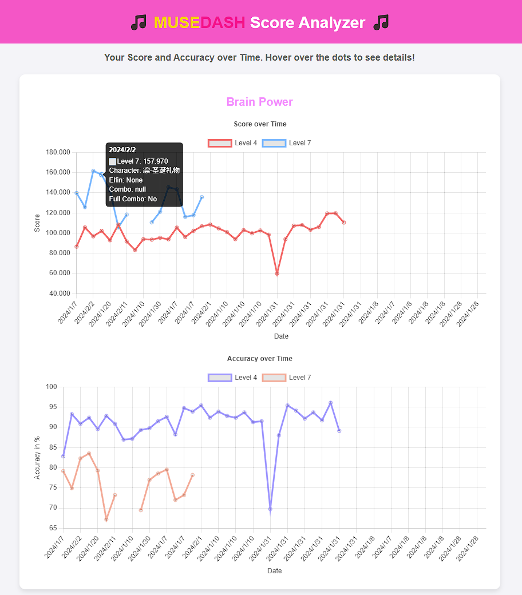

# MuseDashScoreAnalyzer

Helper to view and analyze personal statistic of your Muse Dash scores.

**Status:** This script exports the scores as CSV and JSON and creates a HTML site with charts using [charts.js](https://www.chartjs.org/)

**Disclaimer:** This works only for windows and only for game runs on that specific computer, since it extracts the scores from local log-files. I don't know far back th log-files go, so it might not be able to extract all scores.

## Overall Motivation

I want to have a view of my own Muse Dash scores over time to see how I improve.

- Ideally as an easy-to-use application that anyone can use
- Maybe integrated as a mod for https://mdmc.moe

## Status and Todos

- [x] Export scores as CSV and JSON
- [x] Visualize scores and accuracy per song in a chart
- [ ] translate/map the character and elfin names to english (right now it only shows the chinese names because that's what the log-files contain and I have not found a map from ID to name yet)
    - [ ] create a mapping chart from ID to chinese and english name
- [ ] maybe one chart with all scores to see all scores over time
- [ ] exclude failed runs(`result_finished:false`) from the chart
- [ ] add more charts for different statistics
    - [ ] failed runs
    - [ ] full combo
    - [ ] total runs per song
    - [ ] most used character

# How to use

## Export-MuseDashScores.ps1

1. Download `Export-MuseDashScores.ps1` and `MuseDashAnalytics.html.template`
2. Open powershell
3. Navigate to the directory where the script is located
4. Run the script with `.\Export-MuseDashScores.ps1`
5. The script creates `MuseDashAnalytics.html` and opens it in your default browser

The script will export the scores to a csv file and a json file(with the same content):

- `MuseDashScores.csv`
- `MuseDashScores.json`




# Technical details

## official leaderboard

- MuseDash records the top 4000 of every song online, but even than only with minimal details - e.g. the date is missing
    - https://musedash.moe/player/<Player ID>   (you can get the ID from the gams "account" settings)
    - https://musedash.moe/mdmc/player  this somehow lists different/less scores for me... don't know why
- For custom charts, you can get some scores on your profile... but it doesn't seem to keep all scores: https://mdmc.moe/user/<ID>
    - technically the scores are also recorded in the channel #recent-scores on the [MDMC discord server](https://discord.com/servers/muse-dash-modding-community-812100927468470273)

## SO! How to get **ALL scores**?!

MuseDash creates a log-file very time you open the game. The results of each game is logged to the file. This script reads all log-files and extracts the scores.

The log-files are located in `C:\Users\<Windows Username>\AppData\LocalLow\PeroPeroGames\MuseDash\Logs\`

The Scores seem to get send to PeroPero even when you don't reach the top 4000. This request gets logged:

````text
{"level":"Info","time":"2024/1/1 18:44:13.422","msg":"============== Send to url: https://prpr-muse-dash.peropero.net/statistics/pc-play-statistics-feedback on method: POST ============== 
with data: {"player":"<REDACTED ACCOUNT ID>","player_level":146,"music_uid":"8-1","music_name":"Brain Power","music_difficulty":1,"music_level":4,"character_uid":"25","character_name":"初音未来-虚拟歌手","elfin_uid":"7","elfin_name":"莉莉丝","result_finished":true,"result_acc":90.8499951,"result_score":96850,"result_combo":135,"result_full_combo":false,"controller_name":"KeyboardCustom0"}
with header: {"Authorization":"<REDACTED SECRET>","Version":"3.12.1","Platform":"pc"}","stackTrace":null,"gameId":"com.PeroPeroGames.MuseDash","userId":null,"deviceId":"<REDACTED DEVICE ID>","sessionId":"<REDACTED>","platform":"WindowsPlayer","version":"3.12.1"}
````

The info we are interested in is:

````json
{
  "player": "<REDACTED ACCOUNT ID>",
  "player_level": 146,
  "music_uid": "8-1",
  "music_name": "Brain Power",
  "music_difficulty": 1,
  "music_level": 4,
  "character_uid": "25",
  "character_name": "初音未来-虚拟歌手",
  "elfin_uid": "7",
  "elfin_name": "莉莉丝",
  "result_finished": true,
  "result_acc": 90.8499951,
  "result_score": 96850,
  "result_combo": 135,
  "result_full_combo": false,
  "controller_name": "KeyboardCustom0"
}
````

### notes for future development

- the language isn't fixed to powershell. I'd love to have a real application for this but powershell is what worked fast
- be aware of the format of the data! This is an JSON object with two JSON objects inside!
- the Time and Date is in the outer object(in `time`), so it's not enough to just extract the `with data: {"player":` JSON
- the Date and Time format is non-standard(as far as I understand). The time doesn't include leading zeros
- the `character_name` would need to be mapped to the english character name in the game (or the script needs multiple language support)
- the `elfin_name` would need to be mapped to the english elfin name in the game (or the script needs multiple language support)
- the log-files also contain failed runs by setting `result_finished: false`. In this case the values for `result_score` etc. are empty

### testing

Run the script with `.\ExtractGameData.ps1 -test` to use the test log-file in this repo.

### Export Format

See `.\test` for demo files of the export.

# Additional Notes

- Please open an issue if you have any questions or suggestions, as long as I somewhat understand the code I'm happy for any help
- I heavily use ChatGPT-4 and GitHub Copilot to code. I'm not a professional developer, so please don't judge me for the code quality :D
- Charting is done with [charts.js](https://www.chartjs.org/)